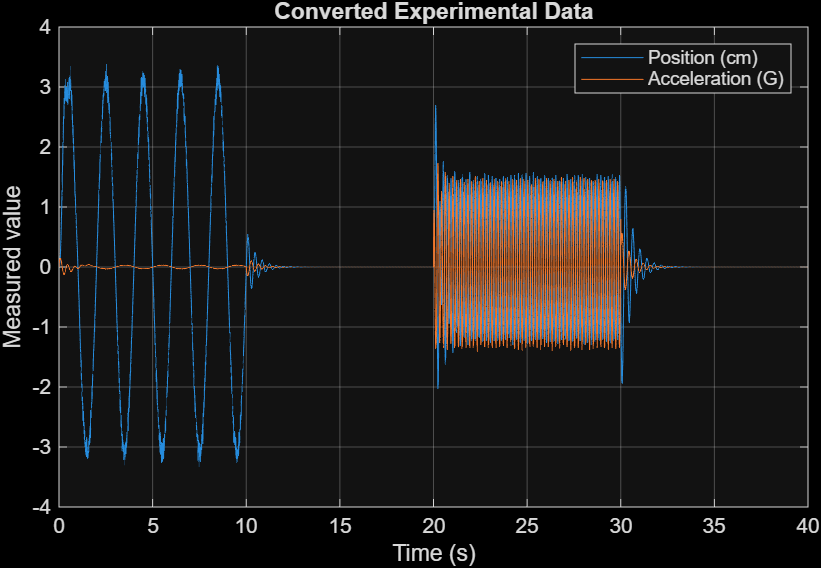
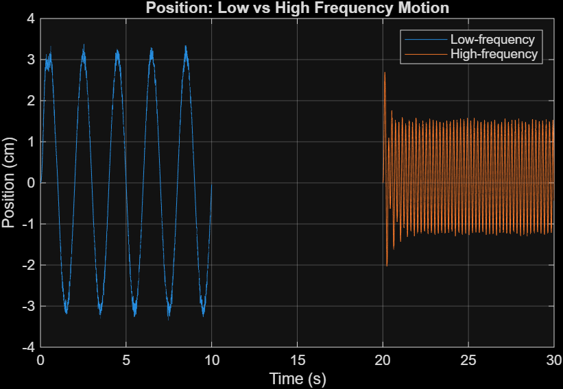
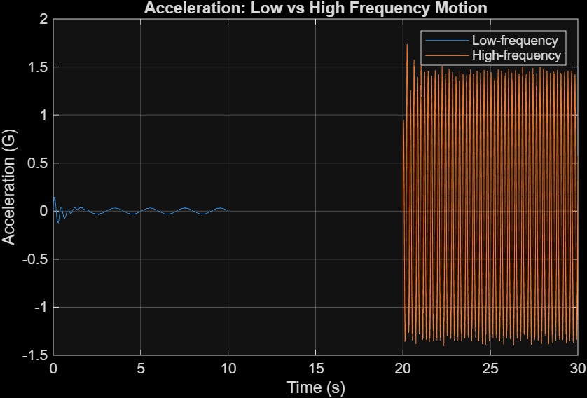
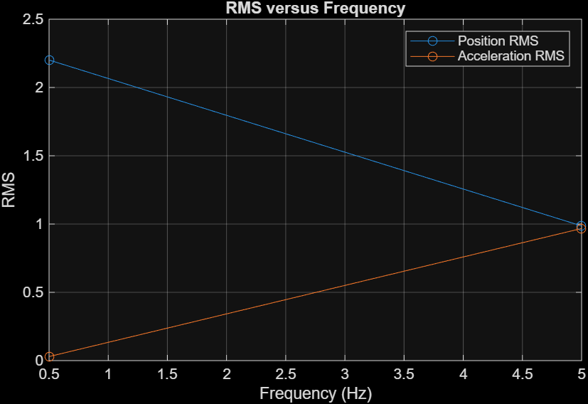

# suspension-data-analysis-matlab
MATLAB project for preprocessing and analyzing suspension sensor data, including RMS, standard deviation, peak-to-peak response, and ride quality comparison.

# Suspension Data Analysis in MATLAB

This repository contains a MATLAB project for preprocessing and analyzing experimental suspension sensor data.

The project compares the suspension response under two excitation frequencies and evaluates ride quality using statistical analysis of position and acceleration signals.

## Project Objectives

The main goals of this project are:

- import and visualize raw experimental data
- convert sensor voltages into physical quantities
- isolate low-frequency and high-frequency motion segments
- calculate RMS values for position and acceleration
- compare signal variability using standard deviation
- evaluate oscillation range using peak-to-peak amplitude
- assess ride quality based on acceleration response

## Experimental Data

The dataset contains the following vectors:

- `time` — measurement time in seconds
- `Vpos` — voltage from the position sensor
- `Vacc` — voltage from the acceleration sensor

### Calibration Equations

The raw voltage signals are converted using the following formulas:

- `position = 3.00 * (Vpos - 0.5)`  
- `acceleration = 5.09 * (Vacc - 0.1)`

## Test Conditions

Two motion regimes are analyzed:

- **Low-frequency motion (0.5 Hz)** → indices `1:2001`
- **High-frequency motion (5 Hz)** → indices `4001:6001`

## Methods Used

The following analysis methods are used:

### 1. RMS
Root-mean-square values are calculated to quantify the overall magnitude of each signal.

### 2. Standard Deviation
Standard deviation is used to describe signal variability around the mean value.

### 3. Peak-to-Peak Amplitude
Peak-to-peak amplitude is used to measure the full oscillation range.

### 4. Ride Quality Assessment
Ride quality is evaluated mainly through the acceleration response. Higher acceleration indicates stronger vibration and lower comfort.

## Main Findings

The analysis shows that:

- the low-frequency test produces larger displacement
- the high-frequency test produces much larger acceleration
- the high-frequency response indicates poorer ride quality due to stronger vibration

## Example Output

### Raw Experimental Data

### Position Response (Low vs High Frequency)

### Acceleration Response (Low vs High Frequency)

### RMS Comparison

## Results Summary

The suspension response was quantitatively evaluated using RMS, standard deviation, and peak-to-peak amplitude.

### Position (cm)
- Low frequency (0.5 Hz):
  - RMS ≈ 2.20
  - STD ≈ 2.20
  - Peak-to-peak ≈ 6.71

- High frequency (5 Hz):
  - RMS ≈ 0.99
  - STD ≈ 0.97
  - Peak-to-peak ≈ 4.73

### Acceleration (G)
- Low frequency (0.5 Hz):
  - RMS ≈ 0.03
  - STD ≈ 0.03
  - Peak-to-peak ≈ 0.27

- High frequency (5 Hz):
  - RMS ≈ 0.97
  - STD ≈ 0.97
  - Peak-to-peak ≈ 3.14

### Interpretation

The low-frequency motion produces larger displacement, while the high-frequency motion produces significantly higher acceleration.

Since ride quality is primarily influenced by acceleration, the high-frequency test (5 Hz) results in stronger vibration and therefore poorer ride comfort.

## How to Run

- Open MATLAB
- Open src/suspension_analysis.m
- Make sure the data file is available in data/workspace_project_1.mat
- Run the script

Author - Nikita Sibgatullin
